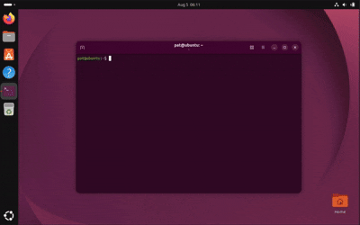

# Dotfiles

[](https://github.com/Patruxs/dotfiles/actions/workflows/ci.yml)
[](LICENSE)

<p align="center">
  
</p>

An opinionated, cross-platform machine bootstrap system and dotfiles manager for Linux, macOS, and Windows. It uses **Ansible** for Linux and macOS orchestration and **Chezmoi** for configuration management.

> [!WARNING]
> The bootstrap scripts install software and change system settings. Review the repository before running them. Fork and customize it if you want to use it as your own dotfiles setup.

## 🚀 Quick start

**Linux**:

```sh
DOTFILES_REPO="https://github.com/Patruxs/dotfiles.git" \
  bash -c "$(curl -fsSL https://raw.githubusercontent.com/Patruxs/dotfiles/main/bootstrap.sh)"
```

**macOS**:

```sh
DOTFILES_REPO="https://github.com/Patruxs/dotfiles.git" \
  bash -o pipefail -c 'curl -fsSL https://raw.githubusercontent.com/Patruxs/dotfiles/main/bootstrap.sh | bash'
```

**Windows (PowerShell)**:

```powershell
$env:DOTFILES_REPO = "https://github.com/Patruxs/dotfiles.git"
irm https://raw.githubusercontent.com/Patruxs/dotfiles/main/bootstrap.ps1 | iex
```

## ⚙️ How it works

```text
Bootstrap script
       ↓
Choose OS and profile
       ↓
Install packages and apps
       ↓
Apply configs with Chezmoi
```

The bootstrap script detects your operating system and asks you to choose a `personal` or `work` profile. It then installs the selected packages and apps using Ansible on Linux and macOS, or PowerShell and Winget on Windows. Finally, Chezmoi applies your shell, Git, tmux, and editor configs.

## 🛠 Everyday usage

```sh
chezmoi add ~/.bashrc    # Manage a new file
chezmoi update -v        # Pull and apply latest changes
chezmoi diff             # See what will change
chezmoi doctor           # Troubleshoot issues
```

To run the bootstrap script manually with a specific profile:

```sh
./bootstrap.sh --profile personal
```

## 🔑 Manual logins

```sh
gh auth login
docker login
ssh-keygen -t ed25519 -C "you@example.com"
```

## 🍴 Make it your own

Fork or clone the repository, replace the owner-specific values, and select the software and configs you want. Follow the [customization guide](CUSTOMIZING.md) for the complete process.

> [!IMPORTANT]
> Never commit passwords, tokens, private SSH keys, or generated application state.

## 📁 Symlink mode

Chezmoi is set to `mode = "symlink"`. Tracked files are symlinked directly into `$HOME`. Any edits made by applications modify the tracked file here.

<details>
<summary><strong>Repository capabilities and profiles</strong></summary>

### Personal and work profiles

The system is split into two primary profiles to keep work machines lean while fully tricking out personal machines.

| Feature / App Category | OS | Personal Profile | Work Profile | Description / Apps Included |
| :--- | :--- | :---: | :---: | :--- |
| **Core CLI & Shell** | Linux, macOS, Windows | ✅ | ✅ | **Tools**: `git`, `curl`, `wget`, `unzip`, `gnupg`, `bash`, `neovim`, `tmux`, `btop`, `ripgrep`, `jq`, `bat`, `fzf`, `zoxide`, `fd`, `eza`, `lazygit`, `gh`, `mole` (macOS). <br> **Configs**: Multi-shell integrations (`bash`, `zsh`, `powershell`), aliases, `.gitconfig` with GitHub CLI credential helper. |
| **Dev Tools & SDKs** | Linux, macOS, Windows | ✅ | ✅ | **Languages**: `nodejs`, `python3`, `gcc`, `go`, `java`. (Plus POSIX UCRT on Windows). <br> **Package Mgrs**: `npm`, `python-pip`, `pnpm`, `uv`, `maven`, `gradle`. <br> **Testing**: `playwright`. |
| **Security / Passwords** | Linux, macOS, Windows | ✅ | ❌ | Bitwarden CLI (`bw`) installed via npm globally. |
| **Desktop Base** | Linux, macOS, Windows | ✅ | ✅ | **Editors**: VS Code, Obsidian. <br> **Utils**: GitButler, LocalSend, GParted (Linux), flatpak (Linux). |
| **Modern Terminals** | Linux, macOS, Windows | ✅ | ✅ | Warp Terminal, Ghostty. |
| **Docker Ecosystem** | Linux, macOS, Windows | ✅ | ✅ | Native Docker Engine + Docker Desktop. |
| **AI CLIs** | Linux, macOS, Windows | ✅ | ✅ | `codex`, `agy`, `droid`, `opencode`, `herdr` (Plus `llmfit` installed natively on Personal only). |
| **System & Desktop Configs** | Linux, macOS, Windows | ✅ | ✅ | SSH host aliases. <br> **Linux-only**: GNOME `dconf` keybindings & UI tweaks, `monitors.xml` (display layout), `user-dirs.dirs` (XDG dirs), `auto-headphone-switch.service` (Systemd), swap/low-memory tuning. |
| **Heavy IDEs** | Linux, macOS, Windows | ✅ | ❌ | JetBrains Toolbox, Kiro IDE. |
| **Virtualization** | Linux, macOS, Windows | ✅ | ❌ | Oracle VirtualBox. |
| **Desktop Apps** | Linux, macOS, Windows | ✅ | ❌ | **Comm/Media**: Telegram, Zoom, Spotify, OBS Studio. <br> **Work/Utils**: Postman, ONLYOFFICE, Edge, Anki, Termius, Bazaar (Linux). <br> **System**: `nvtop` (Linux), TreeSize (Win), RevoUninstaller (Win). |

</details>

## 🤝 Contributing

Issues and pull requests are welcome. Read [CONTRIBUTING.md](CONTRIBUTING.md) and follow the [Code of Conduct](CODE_OF_CONDUCT.md).

For security problems, follow [SECURITY.md](SECURITY.md) instead of opening a public issue.

## 📄 License

Released under the [MIT License](LICENSE).
