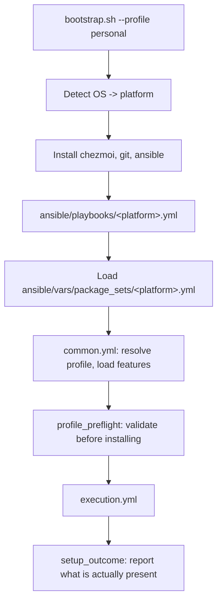

# Architecture

How a setup run works, and which file is responsible for what.

This describes the system as it is implemented today. If you are here to change something rather than understand it, [Adding a feature](adding-a-feature.md) is the shorter path.

## The three concepts

Everything in `ansible/` is built from three ideas. Keeping them separate is the whole point of the design.

### Profile - what a machine is for

A profile is a machine's purpose. It lives in `ansible/vars/profiles/<name>.yml` and does two things: declare which platforms it may run on, and list the features it wants.

```yaml
# ansible/vars/profiles/work.yml
profile_name: work
supported_platforms: [ubuntu, fedora, arch, macos]
features:
  - core_cli
  - devtools
  - docker_desktop
```

A profile never names a package. `git` is not a profile concern; wanting a working command line is. Profile names carry no built-in behavior either - `personal` is not special to the code, it is just the file that happens to select more features than `work` does.

### Feature - a capability, named the same everywhere

A feature is a string like `core_cli`, `docker_desktop`, or `flatpak_apps`. The same name means the same capability on every platform, even though each platform installs it differently. Features have no nested options: when a real choice exists, it becomes its own feature name (`docker_engine` and `docker_desktop` are separate; `webserver_nginx` rather than a generic `webserver`).

Nothing is implicit. A profile gets exactly the features it lists, with no shared default set.

### Platform - one operating system's setup path

A platform is `ubuntu`, `fedora`, `arch`, or `macos`. Each has a standalone playbook in `ansible/playbooks/` and exactly one package set in `ansible/vars/package_sets/`. A run loads only its own platform's data, so an Ubuntu setup can never read Fedora package names.

Windows is deliberately outside this structure. It runs `bootstrap.ps1` with winget and does not use Ansible.

## How a feature gets installed

Each feature is implemented in one of three ways on a given platform.

| Implementation | Use it when | Example |
| :--- | :--- | :--- |
| **Package set only** | The package manager can install it directly | `core_cli`, `devtools` |
| **Feature role only** | Installing needs steps, not just a name | `warp_terminal`, `jetbrains_toolbox` |
| **Both** | Direct packages plus procedural setup | `docker_desktop`, `desktop_base` |

**Package sets are data.** `ansible/vars/package_sets/ubuntu.yml` maps feature names to package entries grouped by installer type, and nothing else. No conditionals, no repositories, no scripts.

```yaml
package_sets:
  core_cli:
    apt: [git, curl, wget, neovim, ripgrep, jq, bat]
  desktop_base:
    apt: [flatpak, gparted]
    flatpak: [com.visualstudio.code, md.obsidian.Obsidian]
```

Installer types are `apt`, `dnf`, `pacman`, `brew`, `cask`, and `flatpak`, depending on the platform.

**Feature roles are behavior.** Anything procedural - adding an apt repository, importing a signing key, downloading a tarball, registering a Flathub remote, enabling a service - lives in `ansible/roles/features/<feature_name>/`. The directory name matches the feature name exactly, which is what lets the preflight check confirm a feature is implemented just by looking at the filesystem.

## A run, start to finish



### 1. Bootstrap picks exactly one playbook

`bootstrap.sh` detects the operating system and maps it to a platform, failing early if the distro has no playbook. It installs the prerequisites (chezmoi, git, Ansible and its collections - on macOS this requires Homebrew to be installed already), then runs a single playbook:

```sh
ansible-playbook -i localhost, ansible/playbooks/ubuntu.yml -e profile=personal
```

`--platform` can override detection, but only under `DOTFILES_CI=1`. On a real machine the detected OS wins, so setup can never be told a lie about what it is running on.

### 2. The platform playbook loads its own data

Each platform playbook (`ubuntu.yml`, `fedora.yml`, `arch.yml`, `macos.yml`) is thin. It defines the `dotfiles_platform` facts - name, package family, distribution, version, architecture - loads its package set into `platform_package_data`, and imports the shared `common.yml`.

`setup.yml` also exists as a compatibility entrypoint that detects the platform itself and forwards to the same `common.yml`.

### 3. `common.yml` resolves the profile and validates

`ansible/playbooks/common.yml` owns everything that is identical across platforms:

- detect the environment: automation (CI), container CI, setup mode, low-memory mode
- resolve the profile from `-e profile=`, then a cached fact, then an interactive prompt, and fail clearly in non-interactive mode when none is available
- load the profile file and derive compatibility variables from its features
- run `profile_preflight`
- run `execution.yml` inside a block whose `always` clause prints the outcome summary, so a failed run still reports

### 4. Preflight fails before anything is installed

`ansible/roles/profile_preflight` refuses to continue unless:

- the profile file exists and declares both `supported_platforms` and `features`
- the current platform is in the profile's `supported_platforms`
- every selected feature has a package-set entry, a matching feature role directory, or both
- every selected feature supports this platform version and architecture (for example, `docker_desktop` on a supported Ubuntu codename and `x86_64`)
- Linux privileged setup can actually authenticate, via passwordless sudo or a supplied password file

An unknown or unsupported feature is an error, never a silent skip. This is the guarantee the rest of the run depends on: by the time a package is installed, the requested machine state is already known to be reachable.

### 5. Execution order belongs to the playbook, not the profile

The order features appear in a profile file means nothing. `ansible/playbooks/execution.yml` owns the real order:

```text
1. low_memory            (Linux, when enabled)
2. chezmoi_setup_data    generate profile/platform/features for templates
3. package_installer     install direct package entries
4. feature roles         in dotfiles_feature_execution_order
5. chezmoi               chezmoi apply
6. services              enable selected services
```

Feature roles run in the fixed sequence declared as `dotfiles_feature_execution_order` in `profile_preflight`, filtered to the features the profile selected. That list is what makes dependencies safe - `desktop_base` before the desktop apps that assume it.

### 6. Chezmoi gets the setup data

Before applying, the run builds a small data object and passes it to Chezmoi with `--override-data`:

```json
{"dotfiles_profile": "personal", "dotfiles_platform": "ubuntu", "dotfiles_features": ["core_cli", "..."]}
```

Templates should branch on platform or features rather than on the profile name. A desktop-only config should ask whether `desktop_base` was selected, not whether the profile is called `personal` - that way a future profile gets the right files without anyone editing the template.

### 7. The run reports what is actually there

`ansible/roles/setup_outcome` prints a verified summary and writes `~/.dotfiles_setup_report.md`. It is an outcome report, not an attempt log: where a stable local query exists it checks afterwards whether selected entries are present, then groups results by installer, and lists completed phases, entries that were selected but not detected, intentionally skipped entries, and collected errors.

## Setup modes

Two modes control what happens when an installer fails.

| Mode | Behavior | Use for |
| :--- | :--- | :--- |
| `best_effort` (default) | Package installs, feature roles, `chezmoi apply`, and services continue after a failure and are collected into the final report | Real machines, where one broken upstream installer should not abandon the run |
| `strict` | The first failure stops the run | Debugging and CI-style verification |

Setup mode never relaxes correctness. Profile, platform, unsupported-feature, and sudo checks stay strict in both modes, because those failures mean setup does not know what machine state it is aiming for.

## Why it works this way

The rules above look fussy in isolation. Each one exists because of a specific failure, and knowing which failure makes them easier to follow and easier to argue with.

### Profiles do not name packages

The original problem was multiplication. Setup organized around whole machines meant `ubuntu-personal`, `ubuntu-work`, `ubuntu-server`, `fedora-personal`, and one more file every time either axis grew. Splitting purpose from implementation means a new profile costs one file and a new platform costs one file, instead of one per combination.

This is also why profile names carry no behavior. `personal` is not special to the code - it is just the file that lists more features. The feature list is the entire contract, so if a work machine needs desktop tools, the work profile says so out loud rather than inheriting them from its name.

For the same reason, nothing is implicit. Even `core_cli` must be listed by every profile that wants it. It is slightly repetitive, and the payoff is that a profile file can be read top to bottom as the complete intended state of that machine.

### One playbook per operating system

An Ubuntu run should not contain Fedora task paths, even skipped ones. When it does, the output stops describing the machine in front of you - you scroll past dozens of `skipping:` lines looking for the thing that actually ran, and a mistake in the Arch branch stays invisible until an Arch user hits it.

Loading exactly one playbook and exactly one package set makes the run self-describing. It also makes a whole class of bug impossible rather than merely unlikely: Ubuntu cannot accidentally read a macOS package name, because that file was never opened.

macOS follows the same structure with Homebrew underneath. Windows deliberately does not - it stays on PowerShell and winget rather than being forced into a playbook shape that does not fit it. It may adopt the profile and feature vocabulary later without adopting Ansible.

### Package sets hold data, roles hold behavior

Once a package list can contain a conditional, it will, and then the question "what does this platform install?" can no longer be answered by reading the list. Keeping repositories, keys, downloads, remotes, and services in roles means package sets stay skimmable, and behavior stays somewhere a person expects to find behavior.

Feature role directories are named after their features exactly. That is not tidiness - it is what lets preflight answer "is this feature implemented?" by listing a directory, with no registry to maintain and no way for the registry to drift from reality.

A feature can be data, a role, or both, which avoids the alternative of creating empty roles for simple package groups just to satisfy a rule.

### Being specific beats being general

`docker` sounds like one feature until you try to install it. Docker Engine and Docker Desktop install different things and conflict on Linux, so a profile has to say which one it means. The same logic gives `webserver_nginx` rather than `webserver` with an option, and separates `devtools`, `npm_global_tools`, and `ai_clis` so that a server does not quietly acquire a set of AI CLIs because they happened to be bundled with a compiler.

The general rule: when a feature would need an option, make it two features. Names are cheap, and a name that appears in a profile is visible in a way a nested config value is not.

### Failing early, and never silently

A selected feature that cannot be installed here is a bug in the request, not a condition to work around. If setup skipped it quietly, a successful-looking run would leave the machine missing a capability someone explicitly asked for, and the output would stop being trustworthy.

So preflight runs before anything is installed and refuses unknown features, unsupported platform and version combinations, and profiles that do not declare where they may run. The point is to fail while the machine is still untouched. A run that stops at validation costs you nothing; a run that stops halfway through package installation leaves a machine in a state nobody designed.

The `best_effort` default is not in tension with this. It applies only after the target state is known and validated, where the remaining failures are external - an upstream installer that moved, a flaky download. Those should not abandon the run, but they must be reported. Correctness checks stay strict in both modes.

That is also why the final report verifies rather than narrates. An attempt log tells you what setup tried; this checks afterwards what is actually present, which is the only version of the question worth answering.

### Order belongs to the playbook

Profiles are declarative, so the order features appear in them means nothing. If it did, every profile author would need to know that `desktop_base` must precede the apps that assume it - a dependency graph maintained by convention in every file, forever.

Instead one list in `profile_preflight` owns the order, and profiles just say what they want.

### Templates ask about features, not profiles

`{{ if eq .dotfiles_profile "personal" }}` works until there is a third profile, and then it needs editing, and so does every other template that made the same assumption. `{{ if has "desktop_base" .dotfiles_features }}` describes what the config actually depends on, so a new profile gets the right files without touching a single template.

This is why every profile runs `chezmoi apply`, including future server profiles. Guarded templates, not skipped applies, are what keep desktop config off a server.

### CI runs the real path

It is tempting to run CI with lightweight mode on, since it is fast and green. But it skips so much of the install flow that a pass stops meaning anything about a real machine.

So CI runs the normal path and skips only the specific surfaces that cannot work in a hosted runner - Flatpak payloads in containers, upstream shell installers in automation. Everything else is exercised for both profiles across all five platforms, including a second run to prove the setup is idempotent.

## Where things live

```text
bootstrap.sh                          Unix/macOS entrypoint: detect, prepare, run one playbook
bootstrap.ps1                         Windows entrypoint: winget, separate path

ansible/playbooks/
  ubuntu.yml fedora.yml arch.yml macos.yml   one per platform, thin
  setup.yml                           compatibility entrypoint that detects the platform
  common.yml                          profile resolution, validation, shared wrapper
  execution.yml                       the ordered phases of a run
  feature_best_effort.yml             runs one feature role under the current setup mode

ansible/vars/profiles/                what a machine is for
ansible/vars/package_sets/            how each platform installs each feature

ansible/roles/
  profile_preflight/                  validation before any install
  package_installer/                  direct package entries
  chezmoi_setup_data/                 data handed to templates
  chezmoi/                            chezmoi apply
  services/                           service enablement
  setup_outcome/                      verified end-of-run report
  low_memory/                         swap and installer throttling on small machines
  features/<feature_name>/            procedural feature implementations

home/                                 the Chezmoi source directory
test/                                 harness and bootstrap regression checks
```

## What the tests protect

`./test/test_harness.sh` runs the fast checks. The regressions that matter to this design:

- Ubuntu runs only `ansible/playbooks/ubuntu.yml` and loads only the Ubuntu package set
- other platforms' package data is never read during an Ubuntu run
- unknown features fail before installation
- unsupported profile and platform combinations fail before installation
- `--platform` works under CI and is rejected on real machines

CI runs the full bootstrap and an idempotency check for both profiles on Ubuntu, Fedora, Arch, macOS, and Windows. It skips installer surfaces that are known to be unreliable in hosted runners - Flatpak app payloads in containers, upstream AI CLI shell installers - rather than switching on lightweight `DOTFILES_CI` mode, which would skip too much of the real path to be meaningful.
